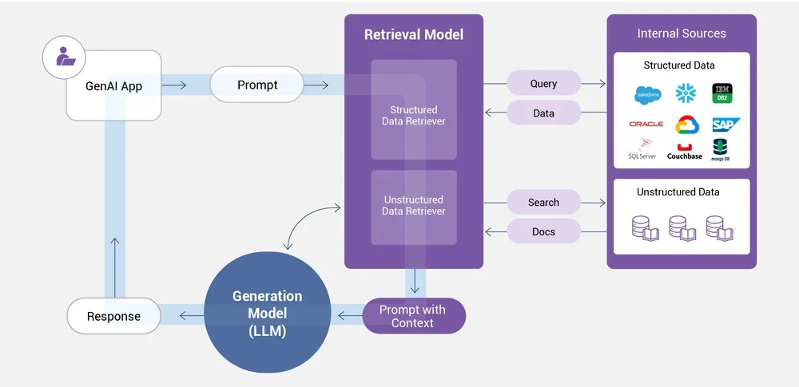
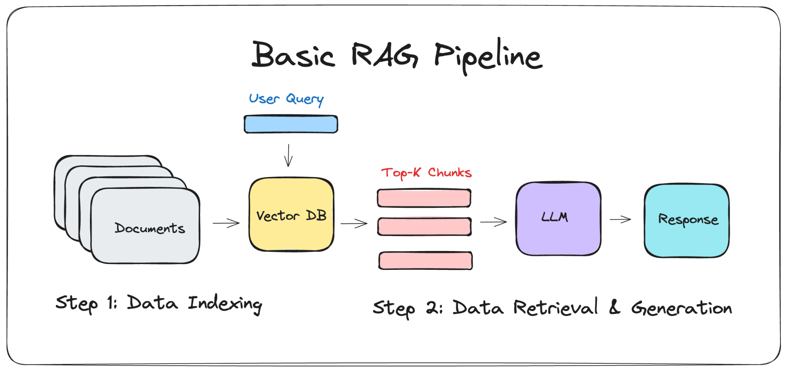

# enterprise-RAG-automation-chatbot

An automated Retrieval-Augmented Generation (RAG) system that converts company FAQ documents into an AI-powered knowledge assistant using semantic search and large language models.

---

## Overview

This project implements a complete RAG pipeline using n8n, Pinecone, Google Gemini embeddings, and OpenRouter.

It automatically ingests documents, converts them into vector embeddings, stores them in a vector database, and allows an AI agent to answer user queries using context-aware retrieval.

---

## Architecture

### 1. Enterprise RAG Architecture

---

### 2. Basic RAG Pipeline

---

### 3. n8n Workflow Implementation

---

## Tech Stack

- n8n (workflow automation)
- Pinecone (vector database)
- Google Gemini (embeddings – 3072 dimensions)
- OpenRouter (LLM)
- Google Drive (document source)

---

## How It Works

1. Documents are uploaded to Google Drive.
2. n8n triggers ingestion automatically.
3. Text is split and converted into embeddings.
4. Embeddings are stored in Pinecone.
5. The AI agent retrieves relevant context.
6. The LLM generates a grounded response.

---

## Setup

1. Import `rag pipeline chatbot.json` into n8n.
2. Configure credentials:
   - Google Drive OAuth2
   - Google Gemini API
   - Pinecone API
   - OpenRouter API
3. Activate the workflow.

